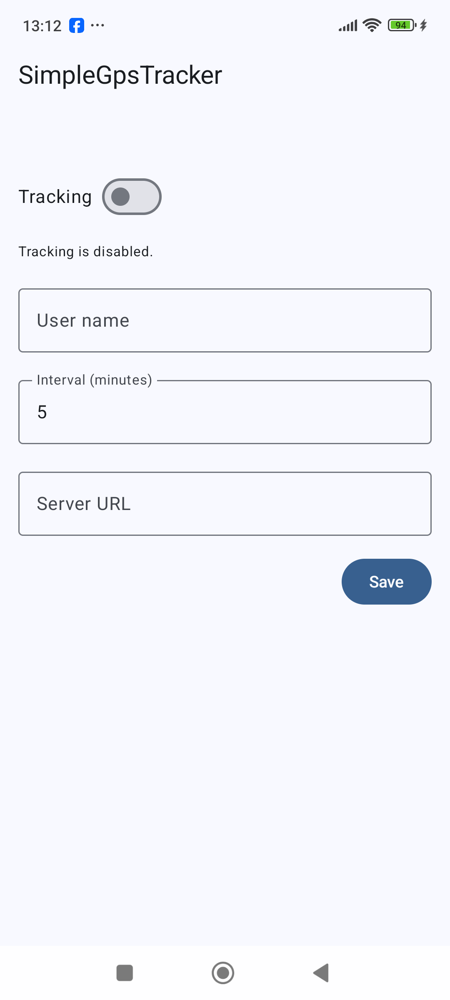
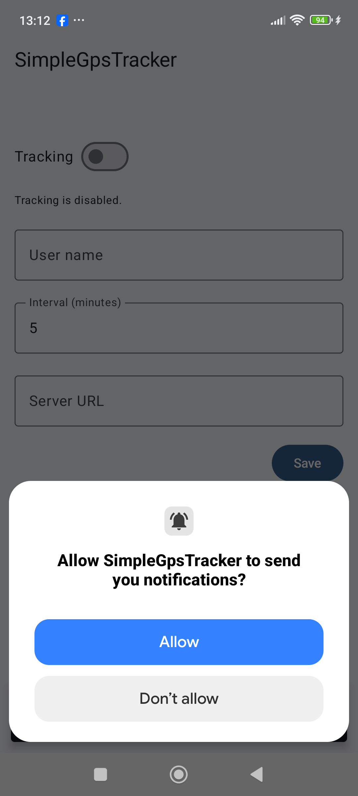
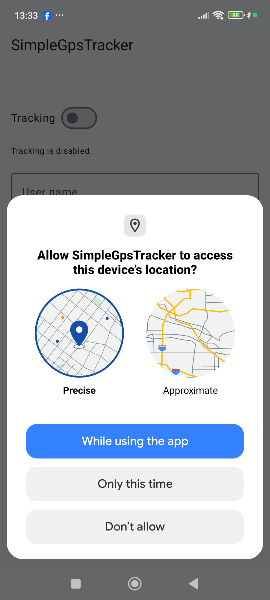
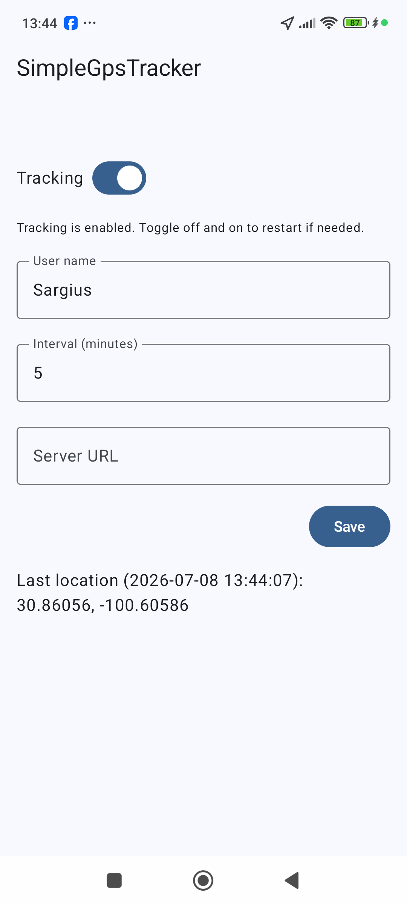
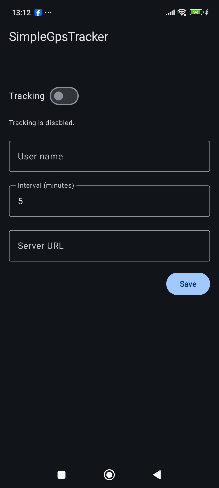
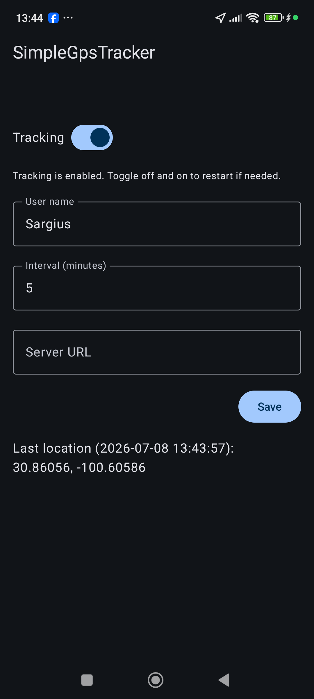

# SimpleGpsTracker (Android)

SimpleGpsTracker is a demo Android app written in Kotlin and Jetpack Compose that periodically records the device’s GPS location in a foreground service and sends it to a configurable backend (Ktor server, e.g. SimpleGpsTrackerServer).

The project is structured as a small, realistic portfolio example of modern Android + Ktor backend development.

---

## Features

- Foreground GPS tracking with a persistent notification
- User-configurable:
  - Tracking on/off
  - Tracking interval (minutes)
  - Base server URL (no hardcoded endpoint)
  - User name
- Sends JSON payloads to {BASE_URL}/api/v1/locations
- Displays:
  - Last sent latitude/longitude
  - Last location timestamp (date + time)
  - Simple tracking status text
- Clean architecture with modularization:
  - app – UI, DI wiring, foreground service
  - core-domain – models, use cases, repository interfaces
  - core-data – Ktor client, DataStore, mappers

---

## 📸 Screenshots

<p align="center">
  <b>Modern MVI & Compose UI</b><br>
  
  
  
  
  
  
</p>

---

## Tech Stack

### Android

- Kotlin
- Jetpack Compose (Material 3)
- Hilt (dependency injection)
- Coroutines + StateFlow
- Fused Location Provider (Google Play Services Location)
- Foreground Service with notification (Android 13+ permissions)
- DataStore (preferences) for configuration

### Networking

- Ktor HTTP client
- Kotlinx Serialization (JSON)

### Architecture

- Modular: `app`, `core-domain`, `core-data`
- Domain:
  - `LocationPoint`, `TrackingConfig`
  - Use cases: observe/update tracking config, observe location
- Data:
  - `LocationApi` + `KtorLocationApi`
  - `TrackingConfigRepository` + DataStore

### Backend (companion project)

- Ktor server ([SimpleGpsTrackerServer](https://github.com/UDeedIt/SimpleGpsTrackerServer))
- Kotlinx Serialization
- Docker
- Google Cloud Run

---

## JSON Contracts

### Request (Android → Server)

Endpoint

```text   
POST {BASE_URL}/api/v1/locations   
```

Body (LocationPayload)

```json   
{   
  "deviceId": "330be5e7-bef9-47f8-aeb3-5823aac7e6b2",   
  "userName": "Demo User",   
  "latitude": 40.2016878,   
  "longitude": 44.5144951,   
  "accuracyMeters": 8.3,   
  "timestampMillis": 1783347145469
}
```

- deviceId: stable user/device ID (UUID)
- userName: optional user‑friendly name
- latitude, longitude: decimal degrees
- accuracyMeters: optional accuracy radius in meters
- timestampMillis: UNIX time in milliseconds (UTC)

### Response (Server → Android)

Body (LocationResponse)

```json   
{   
  "status": "ok",   
  "message": "Location received"
}
```

The app logs the HTTP status and full JSON body for each sent location, e.g.:

```text   
Sent location successfully (HTTP 200, body={"status":"ok","message":"Location received"}): LocationPayload(...)
```

## Running the Android App

1. Clone the repository and open it in Android Studio.
2. Build and run on a device/emulator with Google Play Services.
3. On first run:
   - Grant location permission when requested.
   - On Android 13+, optionally grant notifications so the tracking notification is visible.

### Configure the backend

In the main screen:

- Set Base server URL to your backend (e.g. your Cloud Run URL):

```text   
https://simplegpsserver-xxxxxxxxxx-uc.a.run.app
```

The app will automatically send to:

```text
   {BASE_URL}/api/v1/locations
```

(no path configuration needed in the UI).

### Start tracking

- Turn the Tracking switch ON:
  - If permission is not yet granted, the app will request it.
  - If permission is denied, the switch is forced back to OFF and tracking will not start.
  - If permission is granted, the foreground service starts and a notification appears.
- The UI will show:
  - Tracking status text
  - Last location coordinates
  - Last location timestamp (date + time)

> Note: After some OEM/battery‑saver conditions, you may need to toggle tracking OFF → ON once to restart tracking for that session. This is acceptable for this demo project.

## Development Notes

- Tracking is implemented via a foreground service with foregroundServiceType="location" and proper runtime permission checks.
- The forwarder to the backend is implemented with Ktor client in core-data, and the Android module logs status and server response bodies.
- The backend project (SimpleGpsTrackerServer) is a small, separate Ktor server that:
  - Receives LocationPayload JSON
  - Logs payloads
  - Returns a LocationResponse JSON
  - Is containerized and deployed to Google Cloud Run

---

## License

MIT.